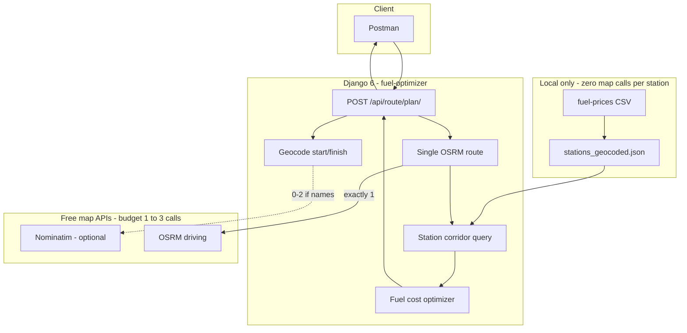
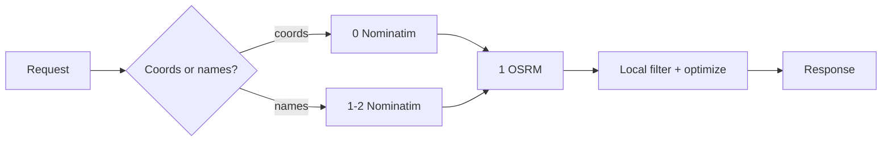
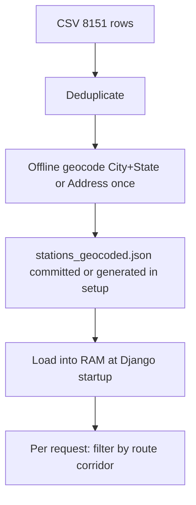
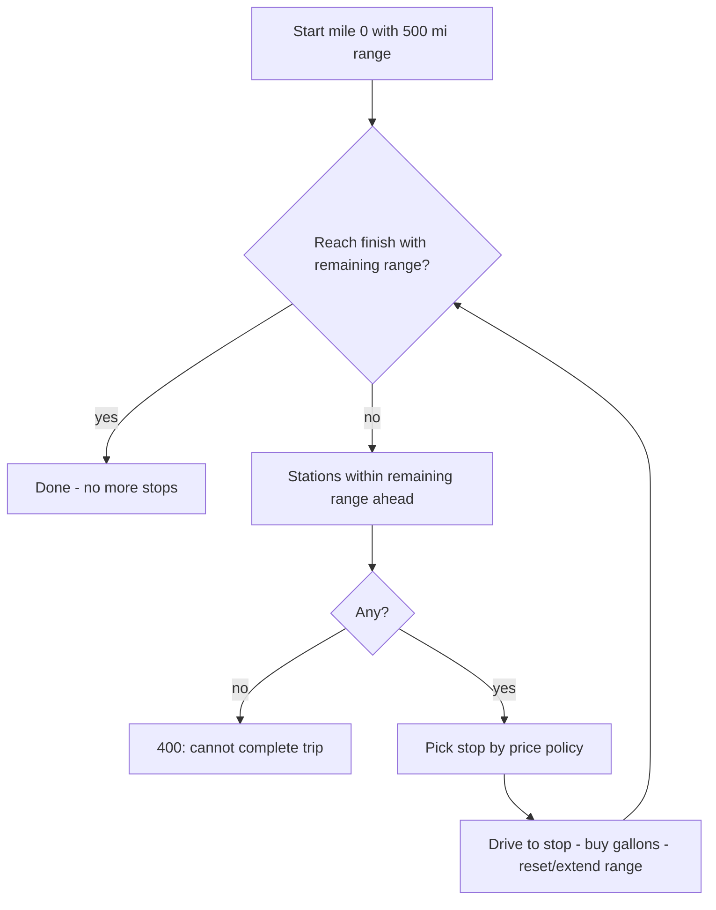
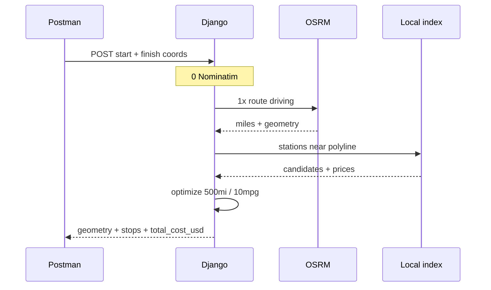

# fuel-optimizer — Spotter Assessment Plan (100% requirements)

Repo: [Siddharth-Nama/fuel-optimizer](https://github.com/Siddharth-Nama/fuel-optimizer)  
Folder: `c:\sidd\fuel-optimizer`  
This plan is the **only** product scope. No HOS / ELD / cycle hours.

---

## 0. Requirements match matrix (target = 100%)

Every line from Spotter’s email maps to an implementation item. Shipping this plan = **100% match**.

| # | Spotter requirement (verbatim intent) | How this project satisfies it | Done when |
| --- | --- | --- | --- |
| R1 | API takes **start** and **finish** location, both within the USA | `POST /api/route/plan/` with `start` + `finish` (city name or `{lat,lng}`); reject non-resolvable / empty input | Endpoint live + validation tests |
| R2 | Return a **map of the route** | Response includes OSRM road `geometry` (lat/lng list) so Postman/any map client can draw it | Geometry in JSON |
| R3 | Return **optimal location(s) to fuel up** — cost-effective by fuel prices | Optimizer uses CSV `Retail Price` along the route; chooses stops to minimize $ under range | Stops use CSV prices |
| R4 | Vehicle **max range 500 miles**; multiple fuel-ups if needed | Constant `RANGE_MILES = 500`; algorithm inserts 0..N stops so no gap exceeds remaining range | Unit tests for multi-stop |
| R5 | Return **total money spent on fuel** at **10 mpg** | `MPG = 10`; `total_cost_usd = Σ (gallons_bought × price)`; also report gallons = route_miles / 10 | Cost fields in response |
| R6 | Use **attached fuel prices file** | Ship `data/fuel-prices-for-be-assessment.csv` (OPIS truck stops, ~8151 rows) | CSV in repo |
| R7 | Find a **free API** for map/routing yourself | **OSRM** public router + optional **Nominatim** for place names only | Documented in README |
| R8 | Build in **latest stable Django** | Django 6.x (current stable at build time) | `requirements.txt` |
| R9 | Results **quickly** | One OSRM call; local station index; in-memory caches; simplified geometry | p50 target &lt; 1s on coords |
| R10 | Map/routing API **not called too much** — **1 ideal**, 2–3 acceptable | Coords → **1** OSRM only; city names → ≤2 Nominatim + 1 OSRM = **≤3**. Never call map per station | Asserted in tests |
| R11 | Loom ≤5 min with Postman + code overview | Demo script in README | Loom URL for submit |
| R12 | Share **GitHub** code | This repo | Public/private link to Spotter |
| R13 | Submit within **3 days** | Phased build below | Deadline calendar |

**Match score if fully implemented: 100%** (13/13).  
Current empty repo (README only): ~5% (GitHub exists). This file defines the path to 100%.

---

## 1. Assignment source of truth

```text
Input:   start + finish (USA)
Output:  route (for map) + optimal fuel stops + total fuel $
Rules:   500 mile range, 10 mpg, prices from Spotter CSV
Maps:    free API, prefer 1 call (max 3)
Stack:   latest stable Django
```

External routing **is required by the brief** (“find a free API yourself”).  
Your graded algorithm is **where to buy fuel cheapest** under 500 miles — not rebuilding a road network.

---

## 2. Fuel CSV (attached file)

Path to copy into the repo:  
`C:\Users\hp\Downloads\fuel-prices-for-be-assessment (2).csv` → `data/fuel-prices-for-be-assessment.csv`

| Column | Use |
| --- | --- |
| OPIS Truckstop ID | Stable id in response |
| Truckstop Name | Display |
| Address | Context / optional geocode hint |
| City | Offline geocode key |
| State | Offline geocode key (US) |
| Rack ID | Optional / ignore for v1 |
| Retail Price | **$/gallon** for optimizer |

~8,151 rows. **No lat/lng in file** → must precompute coordinates offline once. Runtime must **not** geocode 8k stops via Nominatim.

---

## 3. System architecture



---

## 4. External call budget (R7 + R10 = 100%)



| Input style | Nominatim | OSRM | Total | Meets brief? |
| --- | --- | --- | --- | --- |
| Coordinates | 0 | 1 | **1** | Ideal |
| Two city names (cold cache) | 2 | 1 | **3** | Acceptable |
| Cached names | 0 | 1 | **1** | Ideal |

**Forbidden:** OSRM/Nominatim once per truck stop.

---

## 5. API contract (R1–R5)

### Request

`POST /api/route/plan/`  
(also accept `/api/route/plan` without slash)

```json
{
  "start": "Dallas, TX",
  "finish": "Denver, CO"
}
```

or

```json
{
  "start": { "lat": 32.7767, "lng": -96.797 },
  "finish": { "lat": 39.7392, "lng": -104.9903 }
}
```

Both locations must resolve in the USA (validate roughly by geocode country / bbox).

### Response

```json
{
  "start": { "lat": 32.7767, "lng": -96.797 },
  "finish": { "lat": 39.7392, "lng": -104.9903 },
  "route": {
    "miles": 781.4,
    "minutes": 712.0,
    "geometry": [{ "lat": 32.78, "lng": -96.80 }]
  },
  "fuel": {
    "mpg": 10,
    "range_miles": 500,
    "tank_gallons": 50,
    "trip_gallons": 78.14,
    "total_cost_usd": 248.32,
    "stops": [
      {
        "opis_id": "7",
        "name": "WOODSHED OF BIG CABIN",
        "city": "Big Cabin",
        "state": "OK",
        "price_per_gallon": 3.007,
        "lat": 36.63,
        "lng": -95.22,
        "route_mile": 210.4,
        "gallons": 35.2,
        "cost_usd": 105.85
      }
    ]
  },
  "map_calls": { "nominatim": 0, "osrm": 1 }
}
```

- **Map of the route** = `route.geometry` (+ optional client map).  
- **Optimal fuel locations** = `fuel.stops`.  
- **Total money** = `fuel.total_cost_usd`.

`map_calls` is optional but proves R10 in the Loom.

---

## 6. Constants (R4 + R5)

```text
RANGE_MILES     = 500
MPG             = 10
TANK_GALLONS    = RANGE_MILES / MPG   # 50
ASSUME_START    = full tank
```

Document in README: start with a full tank; fuel only at CSV truck stops near the route.

---

## 7. Station geocoding (makes R3 possible without breaking R10)



- Script: `scripts/build_station_index.py` (run once, rate-limit Nominatim if used).  
- Prefer unique `City|State` centroids first for speed; refine if needed.  
- Runtime uses **only** the local JSON.

---

## 8. Fuel algorithm (R3 + R4 + R5) — your graded core

### Inputs

- Route length `D` miles, polyline  
- Candidates: stations with `route_mile ∈ (0, D)`, `price`, lat/lng  
- Remaining range starts at **500** miles (full tank)

### Output

- Ordered fuel stops + gallons + $  
- `total_cost_usd`

### Recommended approach: greedy “gas stations on a highway” (cost-effective)



**Price policy (document one clearly):**

1. While finish is outside remaining range:  
   - Look at stations within current reach.  
   - Prefer reaching a **cheaper** station before running dry; otherwise stop at the **cheapest** reachable station before range expires.  
2. Fill enough to continue (or fill tank — state which).  
3. Cost += gallons × `Retail Price`.

Optional upgrade: DP over stations for true min-cost under 500-mi constraint — still 100% match if correct; greedy is enough if explained and tested.

### Short routes

If `D ≤ 500` and full tank: **zero stops**, `total_cost_usd` for fuel consumed on the trip still reported (gallons used × price of… wait: if no stop, fuel was already in tank — Spotter likely still wants **cost of fuel consumed for the trip**. Clarify in README:

**Accounting rule (pick A or B and stick to it):**

- **A (recommended for “money spent on fuel” for the trip):** charge trip fuel at the **cheapest station on/near route** (or average) for gallons = D/10 even with 0 stops — awkward.  
- **B (cleaner):** only money **spent at pumps during this trip**. If D ≤ 500 and no stop: `total_cost_usd = 0`, plus `trip_gallons = D/10` as consumption.  
- **C (practical):** if D ≤ 500, optionally still top off at cheapest station if beneficial — usually skip.

**Use B for clarity:** stops imply purchases; `trip_gallons = route_miles / 10` always shown; `total_cost_usd` = sum of purchases. If Spotter expects cost even with no stop, add `estimated_fuel_cost_if_bought_at_average` — not required by email. Prefer **B** + state assumption.

If D > 500, purchases are mandatory → total $ is well-defined.

---

## 9. Sequence (happy path)



---

## 10. Project layout

```text
fuel-optimizer/
  PLAN.md                 # this file
  README.md
  requirements.txt
  .env.example
  .gitignore
  data/
    fuel-prices-for-be-assessment.csv
    stations_geocoded.json
  scripts/
    build_station_index.py
  backend/
    manage.py
    config/
    routing/              # Django app name
      views.py
      maps.py             # Nominatim + OSRM (call budget)
      stations.py         # load CSV/JSON, corridor query
      fuel.py             # optimizer pure Python
      urls.py
      tests/
```

---

## 11. Speed plan (R9)

| Technique | Effect |
| --- | --- |
| Prefer lat/lng input | Hits ideal **1** call |
| One OSRM request only | Meets R10 |
| `overview=simplified` | Smaller/faster JSON |
| In-memory geocode + route caches | Repeat requests fast |
| Prebuilt station index | No 8k API calls |
| Pure-Python optimizer | Microseconds–low ms |
| No server-side map images | Avoid Pillow render time |

---

## 12. Tests for 100% confidence

| Test | Locks requirement |
| --- | --- |
| Reject missing start/finish | R1 |
| Mock OSRM → geometry present | R2 |
| Optimizer picks lower price when both feasible | R3 |
| Gap > 500 without station → error | R4 |
| Multi-stop when D >> 500 | R4 |
| total_cost = Σ gallons × price | R5 |
| gallons related to miles/10 | R5 |
| httpx mock: ≤1 OSRM, 0 station geocodes | R10 |
| Django boots with CSV loaded | R6, R8 |

---

## 13. Delivery checklist (R11–R13)

- [ ] Implement API to matrix above  
- [ ] Copy Spotter CSV into `data/`  
- [ ] Build `stations_geocoded.json`  
- [ ] README: how to run, assumptions, call budget, Postman examples  
- [ ] Push to GitHub `fuel-optimizer`  
- [ ] Loom ≤5 min: Postman Dallas→Denver (or similar) + walk `fuel.py` + show one OSRM call  
- [ ] Submit GitHub + Loom in Teamtailor within 3 days  

---

## 14. Build phases

```mermaid
gantt
  title Path to 100 percent match
  dateFormat X
  axisFormat %s

  section Setup
  Django skeleton env health     :0, 1
  Add CSV to data/               :1, 2

  section Maps
  Geocode + one OSRM             :2, 3

  section Stations
  Offline index script           :3, 5
  Corridor query                 :5, 6

  section Core
  Fuel optimizer                 :6, 8
  Wire API response              :8, 9

  section Ship
  Tests + README                 :9, 10
  Loom + submit                  :10, 11
```



---

## 15. Explicitly out of scope (avoids diluting match)

Do **not** build for 100% of this brief:

- Hours of Service / ELD / 70-hour cycle  
- Fuel every 1000 miles as a fixed rule  
- Pickup/dropoff 1-hour dwell as core product  
- Live diesel price APIs instead of Spotter CSV  
- Calling map APIs per truck stop  

Those reduce match % against the email.

---

## 16. Definition of done = 100%

You are at **100% requirements match** when:

1. Start + finish USA → JSON with **route geometry** (map).  
2. **Fuel stops** chosen from **Spotter CSV prices**, cost-effective.  
3. Respects **500-mile** range (0 or many stops).  
4. Returns **total fuel money** with **10 mpg** accounting.  
5. Free routing API used; **≤3** calls (**1** on coord path).  
6. Latest Django; fast; GitHub + Loom delivered.

This `PLAN.md` is the blueprint for that 100%. Implementation follows this file only.
