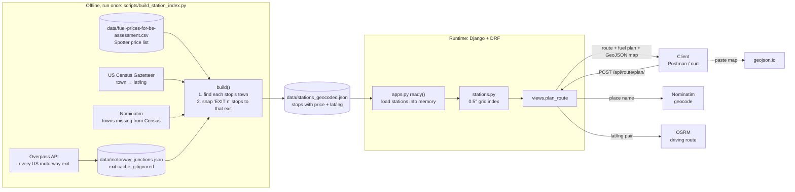
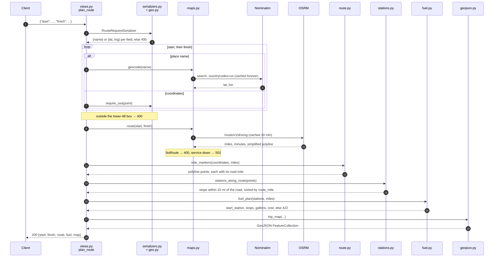
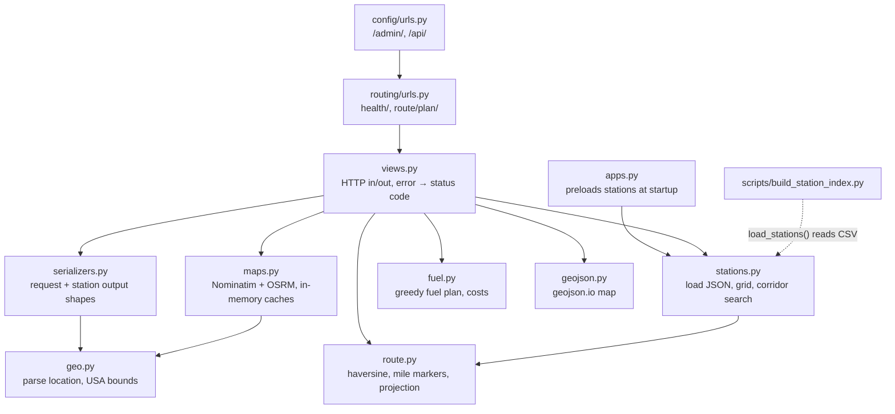
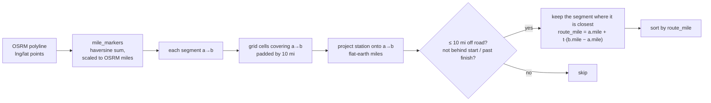
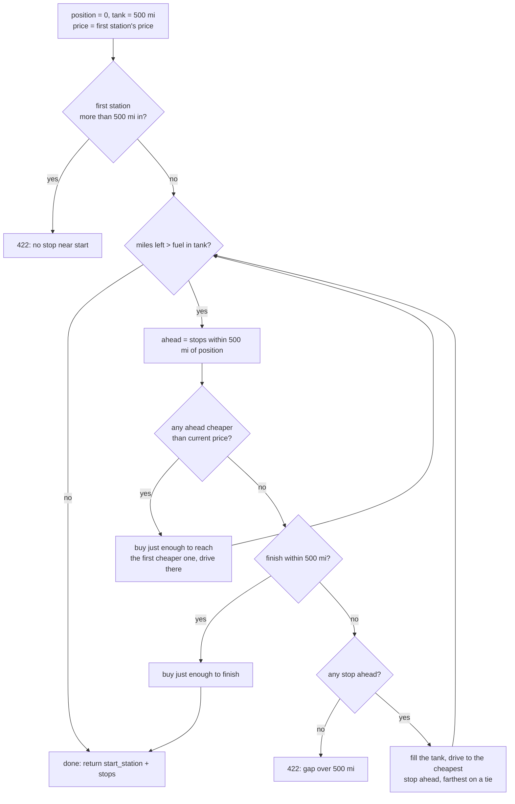

# fuel-optimizer

API for a US driving route and the cheapest truck stops to fuel at along it.

The truck gets 10 miles per gallon and can travel 500 miles on a full 50-gallon tank. Prices come from the Spotter CSV. The road comes from one OSRM call.

## Run

macOS / Linux:

```bash
python3 -m venv venv
venv/bin/python -m pip install -r requirements.txt
venv/bin/python backend/manage.py runserver
```

Windows (PowerShell):

```powershell
python -m venv venv
.\venv\Scripts\python -m pip install -r requirements.txt
.\venv\Scripts\python backend\manage.py runserver
```

`GET http://127.0.0.1:8000/api/health/` returns `{"status": "ok"}`.

## Plan a trip

`POST http://127.0.0.1:8000/api/route/plan/`

```json
{ "start": "Dallas, TX", "finish": "Denver, CO" }
```

```json
{
  "start": { "lat": 32.7767, "lng": -96.797 },
  "finish": { "lat": 39.7392, "lng": -104.9903 }
}
```

The response holds the route geometry, the start station, the ordered fuel stops (each with its `route_mile`, gallons bought and CSV price), `trip_gallons` and `total_cost_usd`. Its `map` field is a GeoJSON FeatureCollection with the route line, start and finish points, and one point per fuel stop. Paste it into [geojson.io](https://geojson.io) to see the trip.

Coordinates make one OSRM call. Two city names add at most two Nominatim lookups. Repeat requests reuse in-memory caches: place names until the server restarts, routes for 10 minutes. A repeated trip makes no external calls.

Import `postman/fuel-optimizer.postman_collection.json` into Postman for these trips, a long coast-to-coast trip, a short trip with no stops, and the error cases.

### Response

```text
start, finish     {lat, lng}, plus name when a place name was sent
route             miles, minutes, geometry [{lat, lng}, ...]
fuel              mpg, range_miles, tank_gallons, trip_gallons, total_cost_usd,
                  start_station {name, city, state, price_per_gallon, lat, lng, route_mile, gallons, cost_usd, ...},
                  stops [{same fields}, ...] in road order
map               GeoJSON FeatureCollection: copy this value into geojson.io
```

### Errors

Every error returns `{"error": "..."}`.

- `400`: the body isn't JSON, `start` or `finish` is missing or empty, a coordinate isn't a number, a place is outside the contiguous United States, or no road connects start and finish.
- `422`: no truck stop within 500 miles of the start, or a stretch of road longer than 500 miles with no truck stop.
- `502`: Nominatim or OSRM is down or too slow. Sending coordinates avoids Nominatim.

## How the fuel plan works

1. The start station is the first truck stop the truck reaches on the road.
2. The tank starts full (500 miles) and is priced at the start station's CSV price.
3. If the finish is within 500 miles, there are no stops.
4. Otherwise, at each point the truck looks ahead one full tank (500 miles):
   - If a cheaper stop is in range, it buys just enough to reach the nearest one. It skips the more expensive stops in between.
   - If no cheaper stop is in range, it fills up. If the finish is closer, it buys only enough to reach the finish. After filling up, it drives to the cheapest stop in range.
5. The trip is charged only for fuel it burns:
   - The starting tank costs start price × the gallons used from it.
   - Each stop costs gallons bought × that stop's price.
   - `total_cost_usd` is the sum of those costs, so it is never $0. A 300-mile trip makes no stops and costs 30 × the start price.
6. `trip_gallons` is always route miles / 10. The gallons charged add up to it.

## Architecture

The service is one Django app, `routing`, with no database models. The station data is built offline into a JSON file. At request time the API reads that file from memory and makes at most three outside calls: two Nominatim lookups and one OSRM route.

### End to end



### Request pipeline

What `POST /api/route/plan/` does, in order. Each step names the file that does it.



### Modules



| File | Job |
| --- | --- |
| `backend/config/settings.py` | Django settings. DRF has no auth and accepts JSON only. |
| `backend/routing/views.py` | `health` and `plan_route`. Maps `InvalidLocation` → 400, `FuelPlanError` → 422, `MapServiceError` → 502. |
| `backend/routing/serializers.py` | `RouteRequestSerializer` validates `start`/`finish`. `StationSerializer` renames `price` to `price_per_gallon` and rounds miles, gallons and dollars. |
| `backend/routing/geo.py` | Turns a request value into `{name}` or `{lat, lng}`. Rejects points outside the lower-48 box. |
| `backend/routing/maps.py` | The only runtime network code. Nominatim results are cached until restart. OSRM routes are cached for 10 minutes, at most 256 of them, keyed on coordinates rounded to 4 decimals. 10 s timeout. |
| `backend/routing/route.py` | `mile_markers` gives each polyline point its distance along the road, scaled so the last point equals OSRM's mileage. `project` measures how far a station sits from one road segment. |
| `backend/routing/stations.py` | Loads `stations_geocoded.json` once and buckets stops into a 0.5° grid. `stations_along_route` checks only the grid cells around each road segment and keeps stops within 10 miles. |
| `backend/routing/fuel.py` | `plan_stops` picks the stops. `fuel_plan` turns miles into gallons and dollars. |
| `backend/routing/geojson.py` | Builds the route line and markers with simplestyle colours for geojson.io. |
| `scripts/build_station_index.py` | Offline geocoder that writes `data/stations_geocoded.json`. It can resume, and `--limit` caps how many stops one run locates. |

### Data

- `data/fuel-prices-for-be-assessment.csv` has 8,151 rows and 6,738 distinct OPIS IDs. `load_stations` keeps the lowest price when an ID repeats and drops rows with no price.
- `data/stations_geocoded.json` holds the 2,918 stops the API uses. Each has `opis_id, name, address, city, state, price, lat, lng`. Canadian rows and stops whose town can't be found are left out.
- The index script places a stop at its town's Census centre. If the address has `EXIT n`, it moves the stop to the motorway junction with that number nearest the town, within 15 miles.
- `backend/db.sqlite3` only backs Django's built-in apps. The routing app has no models.

### Finding stops along the road



### Choosing fuel stops

`plan_stops` in `fuel.py`, with range 500 miles and the truck starting full at the first stop on the road:



`fuel_plan` then divides miles by 10 mpg to get gallons. The starting tank is charged for `min(50, trip_gallons)` at the start station's price, and each stop for the gallons bought there at its own price.

### Errors by layer

| Layer | Exception | HTTP |
| --- | --- | --- |
| DRF parser / `views.py` | bad JSON or not an object | 400 |
| `serializers.py` → `geo.py` | missing, empty or non-numeric location | 400 |
| `geo.py` / `maps.geocode` | outside the lower 48 or place not found | 400 |
| `maps.route` | OSRM `NoRoute` / `NoSegment` | 400 |
| `maps._get_json` | timeout, network error, bad OSRM response | 502 |
| `fuel.plan_stops` | no stop in the first 500 miles, or a 500-mile gap | 422 |
